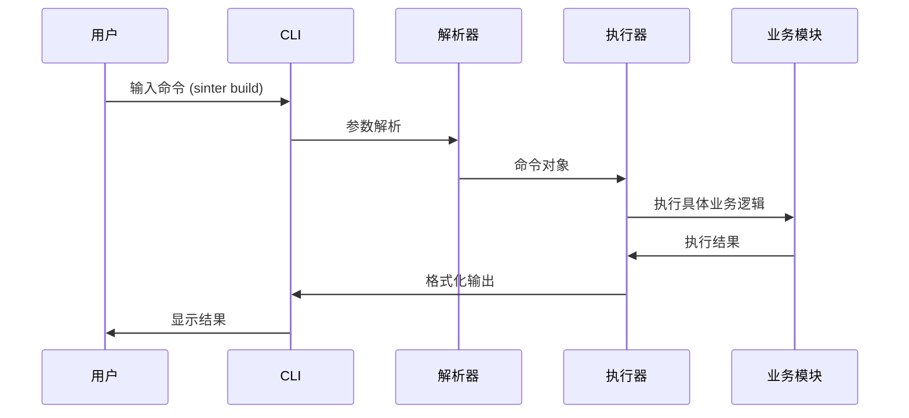
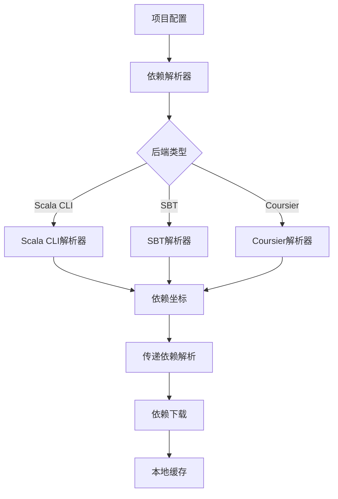
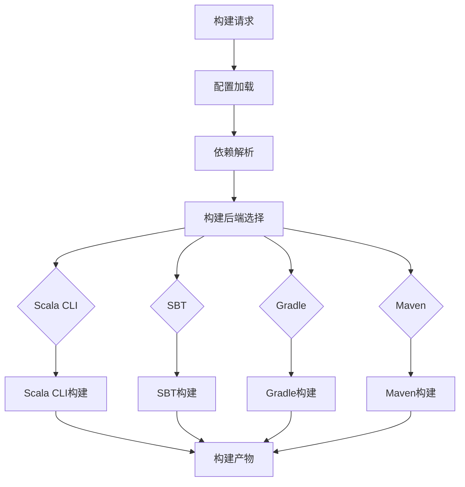
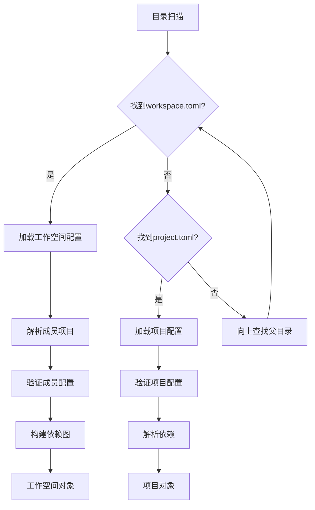

# Sinter 架构文档

## 项目介绍

Sinter 是一个现代化的 Scala 项目构建工具，类似于 Cargo for Rust，但专为 Scala 生态系统设计。它采用领域驱动设计（DDD）原则，提供完整的项目生命周期管理，包括项目创建、依赖管理、构建、测试和运行。

### 核心特性

- 🚀 **现代化构建工具**: 类似 Cargo 的用户体验
- 📦 **多构建后端支持**: Scala CLI、SBT、Gradle、Maven
- 🔗 **智能依赖管理**: 支持 Coursier、Scala CLI、SBT 依赖解析
- 🏗️ **工作空间支持**: 多项目管理和依赖共享
- 🛠️ **IDE 集成**: BSP 协议支持，提供完善的开发工具集成
- 🔌 **插件系统**: 可扩展的插件架构
- 🌍 **国际化**: 多语言界面支持

## 架构图

```
┌─────────────────────────────────────────────────────────────────┐
│                        Sinter Workspace                         │
├─────────────────────────────────────────────────────────────────┤
│  ┌─────────────┐ ┌─────────────┐ ┌─────────────┐ ┌─────────────┐ │
│  │ sinter-cli  │ │sinter-plugin│ │sinter-plugins│sinter-plugin-│ │
│  │  (CLI入口)  │ │    -api     │ │  (插件实现) │    api       │ │
│  └─────────────┘ └─────────────┘ └─────────────┘ └─────────────┘ │
└─────────────────────────────────────────────────────────────────┘
                                   │
                                   ▼
┌─────────────────────────────────────────────────────────────────┐
│                        sinter-core                              │
├─────────────────────────────────────────────────────────────────┤
│  ┌─────────────┐ ┌─────────────┐ ┌─────────────┐ ┌─────────────┐ │
│  │   domain    │ │   config    │ │ dependency  │ │    build    │ │
│  │ (领域模型)  │ │ (配置管理)  │ │ (依赖管理)  │ │ (构建系统)  │ │
│  └─────────────┘ └─────────────┘ └─────────────┘ └─────────────┘ │
│  ┌─────────────┐ ┌─────────────┐ ┌─────────────┐ ┌─────────────┐ │
│  │ workspace   │ │     ide     │ │     cli     │ │   runtime   │ │
│  │(工作空间管理)│ │ (IDE支持)  │ │ (命令行接口) │ │  (运行时)   │ │
│  └─────────────┘ └─────────────┘ └─────────────┘ └─────────────┘ │
└─────────────────────────────────────────────────────────────────┘
```

## 模块说明

### 领域模型 (domain)

**位置**: `crates/sinter-core/src/domain/`

核心业务实体定义，独立于任何技术实现：

- **project.rs**: `Project`、`Package` 结构体，定义项目配置和包信息
- **dependency.rs**: `DependencySpec`、`DependencyDetail` 枚举，定义依赖规范
- **workspace.rs**: `Workspace` 结构体，定义工作空间配置

**设计原则**: 纯数据结构，无业务逻辑，易于测试和重用。

### 配置管理 (config)

**位置**: `crates/sinter-core/src/config/`

负责项目配置文件的加载、解析和写入：

- **loader.rs**: 配置文件加载器，支持 TOML 格式
- **writer.rs**: 配置文件写入器，保持格式化

**职责**: 将配置文件转换为领域对象，或将领域对象序列化为配置文件。

### 依赖管理 (dependency)

**位置**: `crates/sinter-core/src/dependency/`

处理依赖解析和管理，支持多种解析器：

- **resolver.rs**: 依赖解析接口和兼容函数
- **coursier_resolver.rs**: Coursier 依赖解析器
- **scala_cli_resolver.rs**: Scala CLI 依赖解析器
- **sbt_resolver.rs**: SBT 依赖解析器

**职责**: 将依赖规范解析为实际的依赖坐标，支持传递依赖解析。

### 构建系统 (build)

**位置**: `crates/sinter-core/src/build/`

项目构建和运行的核心逻辑：

- **backend.rs**: `BuildBackend` trait，定义构建接口
- **scala_cli_builder.rs**: Scala CLI 构建后端实现
- **sbt_builder.rs**: SBT 构建后端实现
- **builder.rs**: 构建协调器，处理依赖构建
- **runner.rs**: 代码运行器，支持单文件和带依赖运行

**职责**: 协调构建过程，调用相应的构建后端。

### 工作空间管理 (workspace)

**位置**: `crates/sinter-core/src/workspace/`

多项目工作空间的管理：

- **manager.rs**: 工作空间管理器，处理工作空间级操作
- **member.rs**: 工作空间成员管理，处理项目间的依赖关系

**职责**: 管理工作空间成员，解析跨项目依赖。

### IDE 支持 (ide)

**位置**: `crates/sinter-core/src/ide/`

开发工具集成：

- **classpath_generator.rs**: 生成项目 classpath
- **bsp_setup.rs**: BSP 服务器设置和配置

**职责**: 为 IDE 提供必要的项目信息和构建服务。

### 命令行接口 (cli)

**位置**: `crates/sinter-core/src/cli/`

命令行参数解析和命令分发：

- **parser.rs**: 命令行参数解析
- **builtin.rs**: 内置命令实现
- **commands/**: 各具体命令实现

**职责**: 将用户输入转换为内部命令调用。

### 运行时 (runtime)

**位置**: `crates/sinter-core/src/runtime/`

命令执行协调：

- **executor.rs**: 命令执行器，协调各模块工作

**职责**: 编排命令执行流程，确保正确的模块调用顺序。

## 数据流与控制流说明

### 数据流

```
用户输入 → CLI解析 → 命令对象 → 执行器 → 领域对象 → 各业务模块 → 结果输出
```

1. **配置加载**: `config/loader.rs` → `domain/Project`
2. **依赖解析**: `dependency/resolver.rs` → `deps/Dependency`
3. **构建执行**: `build/builder.rs` → 构建产物
4. **结果输出**: 各模块 → 格式化输出

### 控制流

```
CLI 入口
    ↓
参数解析 (cli/parser.rs)
    ↓
命令分发 (cli/builtin.rs)
    ↓
业务逻辑 (runtime/executor.rs)
    ↓
┌─配置管理 (config/)
├─依赖管理 (dependency/)
├─构建执行 (build/)
├─工作空间 (workspace/)
└─IDE支持 (ide/)
    ↓
结果返回
```

## CLI 执行流程



### 详细流程

1. **参数解析**: `cli/parser.rs` 使用 clap 解析命令行参数
2. **命令识别**: 根据子命令分发到对应的处理器
3. **上下文准备**: 加载项目配置和工作空间信息
4. **业务执行**: 调用相应的业务模块处理
5. **结果输出**: 格式化并显示执行结果

## 依赖下载流程



### 流程说明

1. **依赖规范解析**: 将 `DependencySpec` 转换为具体的依赖坐标
2. **传递依赖计算**: 递归解析所有传递依赖
3. **依赖下载**: 使用相应工具下载依赖到本地缓存
4. **缓存管理**: 维护依赖缓存，避免重复下载

## 构建流程



### 构建步骤

1. **环境准备**: 确保构建工具可用，下载必要工具
2. **依赖准备**: 解析并下载所有依赖
3. **构建执行**: 调用相应构建后端执行构建
4. **产物生成**: 输出编译结果和可运行文件

## Workspace/Project 解析流程



### 解析逻辑

1. **工作空间检测**: 从当前目录向上查找 `workspace.toml`
2. **项目检测**: 查找 `project.toml` 文件
3. **配置验证**: 验证配置文件的语法和语义正确性
4. **依赖关系建立**: 解析项目间的依赖关系
5. **对象构建**: 创建相应的领域对象

## 对未来扩展插件系统的建议

### 当前插件系统架构

```
插件API (sinter-plugin-api)
    ↓
插件实现 (sinter-plugins)
    ↓
CLI入口 (sinter-cli)
```

### 扩展建议

#### 1. **插件生命周期管理**

```rust
#[async_trait]
pub trait Plugin: Send + Sync {
    /// 插件初始化
    async fn initialize(&self, context: &PluginContext) -> anyhow::Result<()>;

    /// 插件清理
    async fn shutdown(&self) -> anyhow::Result<()>;

    /// 插件健康检查
    async fn health_check(&self) -> PluginHealth;
}
```

#### 2. **插件通信机制**

```rust
pub struct PluginContext {
    pub event_bus: Arc<EventBus>,
    pub config: Arc<Config>,
    pub workspace: Arc<Workspace>,
}

pub enum PluginEvent {
    ProjectCreated { path: PathBuf },
    DependencyAdded { name: String, version: String },
    BuildCompleted { success: bool, duration: Duration },
}
```

#### 3. **插件市场和发现机制**

```rust
pub trait PluginRegistry {
    async fn discover_plugins(&self) -> Vec<PluginInfo>;
    async fn install_plugin(&self, plugin_id: &str) -> anyhow::Result<()>;
    async fn uninstall_plugin(&self, plugin_id: &str) -> anyhow::Result<()>;
}
```

#### 4. **插件隔离和安全**

- **沙箱执行**: 使用 WebAssembly 或进程隔离运行插件
- **权限系统**: 细粒度的权限控制
- **安全审计**: 插件代码的安全性检查

#### 5. **插件生态系统**

- **官方插件仓库**: 提供高质量的官方插件
- **社区插件市场**: 支持第三方插件发布和发现
- **插件评级系统**: 用户评价和质量保证

#### 6. **扩展点设计**

```rust
pub trait BuildHook {
    async fn pre_build(&self, project: &Project) -> anyhow::Result<()>;
    async fn post_build(&self, project: &Project, result: &BuildResult) -> anyhow::Result<()>;
}

pub trait DependencyHook {
    async fn pre_resolve(&self, deps: &[DependencySpec]) -> anyhow::Result<Vec<DependencySpec>>;
    async fn post_resolve(&self, deps: &[Dependency]) -> anyhow::Result<Vec<Dependency>>;
}
```

### 实施路线图

#### **阶段一: 基础设施完善**
- [ ] 实现插件生命周期管理
- [ ] 添加插件间通信机制
- [ ] 建立插件配置系统

#### **阶段二: 生态系统建设**
- [ ] 创建插件市场
- [ ] 开发常用插件（代码格式化、测试覆盖率等）
- [ ] 建立插件开发文档和示例

#### **阶段三: 高级特性**
- [ ] 实现插件沙箱
- [ ] 添加插件热重载
- [ ] 支持插件依赖管理

这种设计将使 Sinter 成为一个高度可扩展的构建工具平台，能够适应各种 Scala 开发场景的需求。
